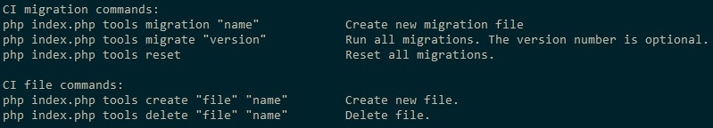

# CI-Tools-Controller
Maintenance controller for Codeigniter3

Migration configs
-----------------
Open /application/config/migration.php and set:
```
$config['migration_enabled'] = TRUE;
$config['migration_type'] = 'timestamp';
```
Terminal commands
-----------------
